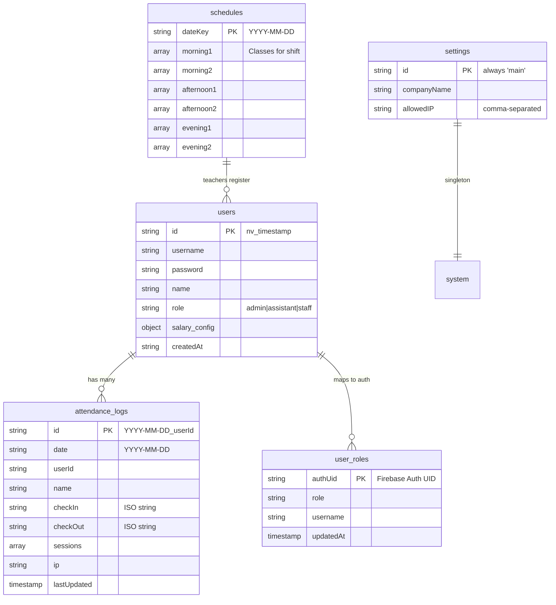

# 📋 HỆ THỐNG CHẤM CÔNG — TÀI LIỆU KỸ THUẬT TOÀN DIỆN

> **Phiên bản**: 2.0 | **Cập nhật**: 16/02/2026
> **Dự án**: Hệ Thống Chấm Công — Trung Tâm Ngoại Ngữ & Toán Tư Duy Trẻ

---

## 1. TỔNG QUAN KIẾN TRÚC

### 1.1 Mô hình kiến trúc

```
┌──────────────┐     ┌────────────────────┐     ┌──────────────────┐
│   Browser    │────▶│   Static Hosting   │────▶│  Firebase BaaS   │
│  (Client)    │     │ (Vercel / Firebase)│     │  (Auth + DB)     │
└──────────────┘     └────────────────────┘     └──────────────────┘
```

- **Loại**: Client-Side Rendering (CSR) + Multi-Page Application (MPA)
- **Backend**: Không có server truyền thống — sử dụng Firebase làm Backend-as-a-Service
- **Hosting**: Static files triển khai trên Vercel hoặc Firebase Hosting
- **Ngôn ngữ**: 100% HTML + Vanilla CSS + Vanilla JavaScript (không framework)

### 1.2 Công nghệ sử dụng

| Thành phần | Công nghệ | Phiên bản |
|---|---|---|
| Frontend | HTML5, CSS3, JavaScript ES6+ | — |
| Authentication | Firebase Authentication (Email/Password) | SDK 10.7.1 (Compat) |
| Database | Cloud Firestore | SDK 10.7.1 (Compat) |
| Security | Firebase App Check (reCAPTCHA Enterprise) | Hiện tại disabled |
| Hosting | Vercel / Firebase Hosting | — |
| Browser API nội bộ | `navigator.geolocation` | Cổng vị trí thật của check-in; không lộ cho nhân viên |

---

## 2. CẤU TRÚC FILE DỰ ÁN

```
TimekeepingSystem/
├── index.html              # Trang đăng nhập chính
├── admin.html              # Dashboard Admin (Tổng quan + Bảo trì)
├── nhan-vien.html          # Trang cá nhân của Staff
├── cham-cong.html          # Trang chấm công (Check-in/out + Lớp học)
├── lich-lam.html           # Quản lý lịch học theo tuần
├── nhan-su.html            # Quản lý nhân sự (CRUD nhân viên)
├── bao-cao.html            # Báo cáo & tính lương
├── he-thong.html           # Cấu hình hệ thống (IP, tên công ty)
├── firestore.rules         # Security Rules cho Firestore
├── SYSTEM_DOCUMENTATION.md # Tài liệu này
│
├── js/
│   ├── firebase-config.js  # ⚙️  Cấu hình Firebase + App Check
│   ├── auth-guard.js       # 🔒 Bảo vệ trang khỏi truy cập trái phép
│   ├── auth-helper.js      # 🔑 Helper cho tạo/sửa/xóa Firebase Auth user
│   ├── db-service.js       # 💾 Tầng trung gian Firestore (882 dòng - file lớn nhất)
│   ├── main.js             # 🏠 Logic chính: login, sidebar, dashboard
│   ├── timekeeping.js      # ⏰ Logic chấm công (check-in/out, lịch sử)
│   ├── schedule.js         # 📅 Quản lý lịch học theo tuần
│   ├── personnel.js        # 👤 CRUD nhân viên + cấu hình lương
│   ├── report.js           # 📊 Báo cáo, tính lương, xuất PDF (file rất lớn)
│   ├── ui-service.js       # 🎨 Toast notifications + confirm dialog
│   ├── ui-animations.js    # ✨ Hiệu ứng dashboard (count-up, stagger)
│   ├── archiver.js         # 🗄️  Scan/Export/Delete dữ liệu cũ
│   └── migration-tool.js   # 🔄 One-time migration từ localStorage lên Cloud
│
├── css/
│   ├── style.css           # Stylesheet chính (design system)
│   └── login.css           # Style riêng cho trang login
│
└── images/
    └── TUDUYTRE.jpg        # Logo trung tâm
```

---

## 3. MÔ HÌNH DỮ LIỆU (FIRESTORE)

### 3.1 Tổng quan Collections



### 3.2 Chi tiết từng Collection

#### `users` — Thông tin nhân viên
```json
{
  "id": "nv_1706000000000",
  "username": "nguyenvana",
  "password": "123456",          // ⚠️ Plaintext — thiết kế có chủ đích
  "name": "Nguyễn Văn A",
  "role": "staff",               // "admin" | "assistant" | "staff"
  "salary_config": {
    "roles": [
      { "id": "role_170...", "name": "GV Tiếng Anh", "rate": 80000, "isDefault": true },
      { "id": "role_170...", "name": "GV Toán", "rate": 70000, "isDefault": false }
    ]
  },
  "createdAt": "2024-01-23T10:00:00.000Z"
}
```

> **Về mật khẩu plaintext**: Đây là lưu để Admin có thể xem/reset mật khẩu cho nhân viên qua giao diện `nhan-su.html`. Bảo mật thực tế dựa trên Firebase Auth (mật khẩu hash bởi Firebase). Chỉ Admin mới truy cập được trang này.

#### `user_roles` — Ánh xạ Firebase Auth UID → Role
```json
{
  // Document ID = Firebase Auth UID (ví dụ: "abc123def456")
  "role": "admin",
  "username": "admin",
  "updatedAt": "2024-01-23T10:00:00Z"  // Server timestamp
}
```

> **Mục đích**: Firestore Security Rules không thể đọc collection `users` (vì dùng custom ID `nv_timestamp`). Collection này dùng Auth UID làm key để Rules có thể verify role.

#### `attendance_logs` — Nhật ký chấm công
```json
{
  // Document ID = "2024-01-23_nv_1706000000000"
  "date": "2024-01-23",
  "userId": "nv_1706000000000",
  "name": "Nguyễn Văn A",
  "checkIn": "2024-01-23T07:30:00.000Z",
  "checkOut": "2024-01-23T17:00:00.000Z",
  "ip": "14.161.22.100",
  "sessions": [
    {
      "id": 1706000000000,
      "start": "2024-01-23T07:30:00.000Z",
      "checkIn": "2024-01-23T07:30:00.000Z",
      "checkOut": "2024-01-23T12:00:00.000Z",
      "type": "auto"           // "auto" | "admin_add"
    },
    {
      "id": 1706050000000,
      "start": "2024-01-23T13:00:00.000Z",
      "checkIn": "2024-01-23T13:00:00.000Z",
      "checkOut": "2024-01-23T17:00:00.000Z",
      "type": "auto"
    }
  ],
  "lastUpdated": "2024-01-23T17:00:00Z"  // Server timestamp
}
```

> **Multi-session**: Mỗi ngày có thể có nhiều ca (sáng/chiều/tối). Mỗi lần check-in tạo session mới. Check-out đóng session gần nhất chưa có `checkOut`.

#### `schedules` — Lịch học
```json
{
  // Document ID = "2024-01-23"
  "morning1": [
    {
      "start": "07:30",
      "end": "09:00",
      "lop": "IELTS 5.0",
      "phong": "P201",
      "gv": "Cô Hoa",
      "note": "",
      "registeredTeachers": [
        { "id": "nv_170...", "name": "Nguyễn Văn A" }
      ]
    }
  ],
  "morning2": [],
  "afternoon1": [],
  "afternoon2": [],
  "evening1": [],
  "evening2": []
}
```

> **Schedule Inheritance**: Nếu ngày hôm nay chưa có lịch, hệ thống tự động tìm ngày cùng thứ gần nhất có lịch (tìm lùi tối đa 4 tuần) và trả về lịch đó. Logic nằm trong `DBService.getSchedule()`.

#### `settings` — Cấu hình hệ thống
```json
{
  // Document ID = "main" (singleton)
  "companyName": "TRUNG TÂM NGOẠI NGỮ VÀ TOÁN TƯ DUY TRẺ",
  "allowedIP": "14.161.22.100, 113.20.10.5"
}
```

---

## 4. HỆ THỐNG BẢO MẬT

### 4.1 Các tầng bảo mật

```
┌─────────────────────────────────────────────┐
│  Tầng 1: Firebase Authentication            │
│  → Email/Password login (username@tdt.app)  │
├─────────────────────────────────────────────┤
│  Tầng 2: Firestore Security Rules           │
│  → Kiểm tra Auth UID + Role từ user_roles   │
├─────────────────────────────────────────────┤
│  Tầng 3: Client-Side Auth Guard             │
│  → Chặn truy cập page nếu chưa đăng nhập   │
├─────────────────────────────────────────────┤
│  Tầng 4: Attendance location gate           │
│  → Nội bộ dùng GPS/radius CS1–CS3           │
├─────────────────────────────────────────────┤
│  Tầng 5: App Check (Disabled)               │
│  → reCAPTCHA Enterprise — cần cấu hình lại  │
└─────────────────────────────────────────────┘
```

### 4.2 Luồng đăng nhập chi tiết

```
User nhập username + password
        │
        ▼
main.js: handleLogin()
        │
        ▼
DBService.loginUser(username, password)
        │
        ├─ 1. Query Firestore: users WHERE username == input
        │     → Nếu không tìm thấy → "Sai tên đăng nhập"
        │     → Nếu password không khớp → "Sai mật khẩu"
        │
        ├─ 2. Firebase Auth: signInWithEmailAndPassword()
        │     Email = username@tdt.app (tự tạo email ảo)
        │     → Nếu Auth fail → Thử tạo tài khoản mới (migration)
        │
        ├─ 3. Sync Role → user_roles/{authUID}
        │     → Chỉ thành công nếu user là Admin (sau fix 16/02/2026)
        │     → Staff: fail silently (có try/catch)
        │
        └─ 4. Return { user, role, authUid }
                │
                ▼
        main.js: Lưu vào localStorage
        ├─ currentUser = username
        ├─ currentRole = role
        ├─ currentUserId = id
        └─ userFullName = name
                │
                ▼
        Redirect → admin.html (admin/assistant)
                 → nhan-vien.html (staff)
```

### 4.3 Auth Guard (`auth-guard.js`)

File này chạy ngay khi page load (trước cả DOMContentLoaded):

```javascript
const currentUser = localStorage.getItem('currentUser');
const currentRole = localStorage.getItem('currentRole');

// Nếu chưa đăng nhập → redirect về index.html
if (!currentUser) {
    window.location.href = 'index.html';
}

// Nếu là trang admin (admin.html, he-thong.html)
// mà role không phải admin → redirect
```

> ⚠️ **Hạn chế**: Auth Guard chỉ check `localStorage`, có thể bypass bằng DevTools. Tuy nhiên, dữ liệu thực sự được bảo vệ bởi Firestore Rules ở tầng server.

### 4.4 Firestore Security Rules — Ma trận quyền

| Collection | Read | Write (Create/Update/Delete) |
|---|---|---|
| `user_roles` | Authenticated + Own doc only | Admin only |
| `users` | All authenticated | Admin only |
| `attendance_logs` | All authenticated | All authenticated |
| `schedules` | All authenticated | All authenticated |
| `settings` | All authenticated | Admin only |

### 4.5 Cổng vị trí chấm công — GPS nội bộ, thông điệp IP/Wifi

```
Check-in request
        │
        ▼
1. Chỉ sau thao tác VÀO CA: xin tọa độ trình duyệt
        │
        ▼
2. Đọc tọa độ/radius GPS của CS1–CS3 từ settings/system
        │
        ▼
3. So sánh điểm thiết bị với vùng cơ sở
   └─ Trong vùng → Cho phép ✅
   └─ Ngoài vùng/không lấy được quyền → Chặn ❌
   └─ UI nhân viên luôn chỉ hiện câu IP/Wifi bắt buộc, không lộ GPS
```

`allowedIP`, DDNS và `enableIPCheck` là dữ liệu legacy/lớp hiển thị; chúng không được phép cho qua,
từ chối hoặc vô hiệu hóa cổng GPS của `checkInPersonal()`.

---

## 5. CHỨC NĂNG CHI TIẾT

### 5.1 Chấm Công (`timekeeping.js` + `db-service.js`)

**Luồng Check-in:**
1. User bấm "Vào Ca" trên `cham-cong.html`
2. `renderGlobalCheckIn()` hiển thị nút dựa trên trạng thái hiện tại
3. Gọi `DBService.globalCheckIn(userId, userName)`
4. DB Service:
   - Kiểm tra GPS/radius CS1–CS3; UI lỗi chỉ dùng thông điệp IP/Wifi
   - Tạo document ID: `YYYY-MM-DD_userId`
   - Dùng Firestore Transaction để đảm bảo atomic
   - Tạo session mới với `checkIn = now`
   - Lưu IP address vào document

**Luồng Check-out:**
1. User bấm "Ra Ca"
2. Gọi `DBService.globalCheckOut(userId)`
3. Transaction:
   - Tìm session cuối cùng chưa có `checkOut`
   - Set `checkOut = now`
   - Cập nhật top-level `checkOut`

**Multi-session logic (Nhiều ca/ngày):**
- Mỗi lần Check-in tạo session mới trong array `sessions`
- Check-out chỉ đóng session cuối cùng đang mở
- Cho phép: Sáng check-in/out → Chiều check-in/out → Tối check-in/out

**Admin thêm ca thủ công:**
- `DBService.adminAddSession(logId, sessionData)`
- Session có `type: 'admin_add'` để phân biệt với `type: 'auto'`

### 5.2 Quản Lý Lịch Học (`schedule.js`)

**6 Ca/ngày:**

| Key | Label | Giờ mặc định |
|---|---|---|
| `morning1` | Sáng - Ca 1 | 07:30 - 09:00 |
| `morning2` | Sáng - Ca 2 | 09:15 - 10:45 |
| `afternoon1` | Chiều - Ca 1 | 14:00 - 15:30 |
| `afternoon2` | Chiều - Ca 2 | 15:30 - 17:00 |
| `evening1` | Tối - Ca 1 | 18:00 - 19:30 |
| `evening2` | Tối - Ca 2 | 19:30 - 21:00 |

**Chức năng theo vai trò:**

| Chức năng | Admin/Trợ lý | Staff |
|---|---|---|
| Thêm lớp | ✅ | ❌ |
| Sửa thông tin lớp | ✅ | ❌ |
| Xóa lớp | ✅ | ❌ |
| Nhận lớp / Hủy nhận | ❌ | ✅ |
| Xem lịch | ✅ | ✅ |

**Schedule Inheritance (Kế thừa lịch):**
```
Ngày hôm nay (Thứ 3) chưa có lịch?
        │
        ▼ 
Tìm lùi 4 tuần: Thứ 3 tuần trước có lịch không?
        │
        ├─ Có → Trả về lịch đó (nhưng xóa registeredTeachers)
        └─ Không → Tìm tiếp tuần trước nữa (tối đa 4 lần)
            └─ Không tìm thấy → Trả về {}
```

**Vietnamese Holiday Detection:**
Tự động nhận diện ngày nghỉ lễ Việt Nam (hardcoded cho 2024-2026):
- Tết Dương Lịch (1/1)
- Tết Nguyên Đán
- Giỗ Tổ Hùng Vương
- 30/4 & 1/5
- Quốc Khánh 2/9

### 5.3 Quản Lý Nhân Sự (`personnel.js` + `auth-helper.js`)

**CRUD Nhân viên:**

| Hành động | Firestore | Firebase Auth |
|---|---|---|
| Thêm | `DBService.saveUser()` | `AuthHelper.createUser()` |
| Sửa | `DBService.saveUser()` | `AuthHelper.syncUser()` |
| Xóa | `DBService.deleteUser()` | `AuthHelper.deleteUser()` |

**Secondary Firebase App:**
`auth-helper.js` tạo một Firebase App instance thứ hai (`tdt-admin-helper`) để thao tác Auth mà không ảnh hưởng session của Admin đang đăng nhập:

```javascript
const secondaryApp = firebase.initializeApp(firebaseConfig, "tdt-admin-helper");
const secondaryAuth = secondaryApp.auth();
// Dùng secondaryAuth để createUser, signIn, delete...
```

**Xử lý Zombie Account:**
Khi tạo user mới mà Firebase Auth trả về `auth/email-already-in-use`:
1. Kiểm tra user có trong Firestore không
2. Nếu không (orphaned Auth account) → Thử "reclaim" bằng cách login với password hiện tại
3. Nếu reclaim thành công → Tạo lại user trong Firestore

**Cấu hình Lương (Multi-role):**
Mỗi nhân viên có thể có nhiều vai trò lương:
```json
"salary_config": {
  "roles": [
    { "name": "GV Tiếng Anh", "rate": 80000 },
    { "name": "GV Toán", "rate": 70000 }
  ]
}
```

### 5.4 Đăng Ký Lớp (`schedule.js` → `db-service.js`)

**Luồng "Nhận Lớp":**
1. Staff bấm "Nhận Lớp" trên lịch
2. Kiểm tra thời gian: Đã hết giờ học → Chặn
3. Gọi `DBService.registerClass(dateKey, caType, { index }, { id, name })`
4. DB Service:
   - Fetch schedule hiện tại
   - Kiểm tra user đã đăng ký chưa
   - Nếu rồi → **Hủy đăng ký** (toggle)
   - Nếu chưa → **Thêm vào** `registeredTeachers[]`
   - Save lại schedule

### 5.5 Dashboard Admin (`main.js`)

Hiển thị 4 stat cards:
1. **Tổng nhân viên** — Count documents trong `users`
2. **Đã chấm công hôm nay** — Count `attendance_logs` WHERE `date == today`
3. **Đi muộn** — Placeholder (--) 
4. **Nghỉ phép** — Placeholder (--)

**Hoạt động gần đây:**
- Lấy 5 sessions mới nhất từ attendance_logs hôm nay
- Sort theo thời gian giảm dần
- Hiển thị: Tên, Giờ, Trạng thái (Đúng giờ / Đang làm / Hoàn thành)

### 5.6 Báo Cáo & Tính Lương (`report.js`)

> **Lưu ý**: File `report.js` rất lớn (1000+ dòng). Logic chính:

- Tính tổng giờ làm theo tháng cho từng nhân viên
- Tính lương dựa trên `salary_config.roles[].rate * totalHours`
- Xuất PDF (sử dụng thư viện client-side)
- Hỗ trợ lọc theo tháng, theo nhân viên

### 5.7 Bảo Trì & Lưu Trữ (`archiver.js`)

3 bước:
1. **Scan**: Query `attendance_logs` cũ hơn N ngày
2. **Export**: Tạo file CSV với BOM UTF-8 cho Excel
3. **Delete**: Batch delete (400 docs/batch, giới hạn Firestore là 500)

> Nút "Xóa" chỉ mở sau khi đã tải backup CSV xong.

### 5.8 UI Service (`ui-service.js`)

- **Toast Notifications**: Thay thế `window.alert()` bằng toast có icon + auto-dismiss sau 3s
- **Confirm Dialog**: Promise-based dialog thay thế `window.confirm()`
- **Tab Switcher**: Chuyển tab trên admin.html (Dashboard ↔ Bảo trì)

### 5.9 UI Animations (`ui-animations.js`)

- **Count-up**: Số trên dashboard chạy từ 0 lên giá trị thực (easing: Out Quad)
- **Table Stagger**: Rows xuất hiện lần lượt với delay 100ms
- **Card Hover**: Glass panel nâng lên + shadow khi hover

---

## 6. ROLE-BASED ACCESS (Ma Trận Phân Quyền)

### 6.1 Trang truy cập

| Trang | Admin | Trợ Lý | Staff |
|---|---|---|---|
| `admin.html` (Dashboard) | ✅ | ❌ | ❌ |
| `cham-cong.html` (Chấm Công) | ✅ | ✅ | ✅ |
| `lich-lam.html` (Lịch Làm) | ✅ | ✅ | ✅ |
| `nhan-su.html` (Nhân Sự) | ✅ | ❌ | ❌ |
| `bao-cao.html` (Báo Cáo) | ✅ | ❌ | ❌ |
| `he-thong.html` (Hệ Thống) | ✅ | ❌ | ❌ |
| `nhan-vien.html` (Cá Nhân) | ✅* | ✅* | ✅ |

> *Admin/Trợ lý có thể chuyển sang chế độ "Staff view" để xem trang cá nhân

### 6.2 Sidebar Navigation

Sidebar được render động bởi `main.js → renderSidebar()`:

| Menu item | Admin | Trợ Lý | Staff |
|---|---|---|---|
| Tổng Quan | ✅ | ❌ | ❌ |
| Chấm Công | ✅ | ✅ | ✅ |
| Lịch Làm | ✅ | ✅ | ✅ |
| Nhân Sự | ✅ | ❌ | ❌ |
| Báo Cáo | ✅ | ❌ | ❌ |
| Hệ Thống | ✅ | ❌ | ❌ |
| Bảng Cá Nhân | ✅ | ✅ | ✅ |
| Đăng Xuất | ✅ | ✅ | ✅ |

---

## 7. CÁC LỖ HỔNG & HẠN CHẾ ĐÃ BIẾT

### 7.1 Đã sửa ✅

| # | Vấn đề | Ngày sửa | Chi tiết |
|---|---|---|---|
| 1 | **user_roles self-escalation** — Staff có thể tự set role=admin | 16/02/2026 | Rule đổi thành `isAdmin()` only |

### 7.2 Chưa sửa / Chấp nhận rủi ro

| # | Vấn đề | Mức độ | Ghi chú |
|---|---|---|---|
| 1 | **App Check disabled** | Trung bình | reCAPTCHA key cần cấu hình lại cho domain hiện tại |
| 2 | **Auth Guard dựa trên localStorage** | Thấp | Bypass qua DevTools, nhưng Firestore Rules vẫn bảo vệ data |
| 3 | **Password plaintext trong Firestore** | Chấp nhận | Thiết kế có chủ đích — Admin cần xem/reset pass cho nhân viên |
| 4 | **attendance_logs open write** | Trung bình | Bất kỳ authenticated user nào cũng có thể sửa bản ghi của người khác |
| 5 | **schedules open write** | Trung bình | Staff có thể sửa lịch qua DevTools (UI chặn nhưng API không) |
| 6 | **Firebase config hardcoded** | Thấp | API key public là bình thường cho Firebase client SDK |

### 7.3 Kỹ thuật nợ (Technical Debt)

| # | Vấn đề | File | Ghi chú |
|---|---|---|---|
| 1 | Duplicate `getDashboardStats()` | `db-service.js` | Có 2 function cùng tên, cái sau ghi đè cái trước |
| 2 | File quá lớn | `report.js` | 1000+ dòng, cần split thành modules |
| 3 | `report_backup.js` | Root | File backup chưa xóa |
| 4 | Duplicate code trong `openModal()` | `personnel.js` | Lines 68-71 lặp lại |
| 5 | Duplicate `\u003c/main\u003e` tag | `he-thong.html` | Line 160 + 164 |
| 6 | Duplicate `\u003c/nav\u003e` tag | `admin.html` | Line 104 + 105 |
| 7 | Duplicate settings load | `he-thong.html` | 2 DOMContentLoaded listeners làm cùng việc |

---

## 8. LUỒNG DỮ LIỆU CHÍNH

### 8.1 Luồng "Nhân viên chấm công buổi sáng"

```
1. Staff mở cham-cong.html
   └─ auth-guard.js kiểm tra localStorage → OK
   └─ main.js: renderSidebar() theo role
   └─ timekeeping.js: renderGlobalCheckIn() → Hiện nút "Vào Ca"
   └─ timekeeping.js: renderTodayClasses() → Hiện danh sách lớp

2. Bấm "Vào Ca"
   └─ DBService.globalCheckIn(userId, userName)
       └─ Lấy GPS từ đúng thao tác bấm
       └─ Fetch settings/system → Check radius CS1–CS3
       └─ Transaction: Tạo/Update attendance_logs/{date}_{userId}
       └─ Session v2 { id, anchorDateKey, status, source, start, checkIn, checkOut }

3. Bấm "Nhận Lớp" cho lớp sáng
   └─ schedule.js: registerClass()
       └─ Kiểm tra: Chưa hết giờ → OK
       └─ DBService.registerClass() → Toggle registeredTeachers

4. Bấm "Ra Ca" khi hết giờ
   └─ DBService.globalCheckOut(userId)
       └─ Transaction: Tìm session chưa có checkOut → Set checkOut = now
```

### 8.2 Luồng "Admin thêm nhân viên mới"

```
1. Admin mở nhan-su.html
2. Bấm "Thêm Nhân Viên" → openModal()
3. Điền form: Tên, Username, Password, Role
4. Submit → handleStaffSubmit()
   └─ AuthHelper.createUser(username, password)
       └─ secondaryAuth.createUserWithEmailAndPassword(email, pass)
       └─ Sign out secondary app
   └─ DBService.saveUser(userPayload)
       └─ db.collection('users').doc(id).set(data)
5. Reload table → renderStaffTable()
```

---

## 9. CẤU HÌNH & TRIỂN KHAI

### 9.1 Firebase Config

```javascript
const firebaseConfig = {
    apiKey: "AIzaSy...",
    authDomain: "tuduytre-d1a35.firebaseapp.com",
    projectId: "tuduytre-d1a35",
    storageBucket: "tuduytre-d1a35.appspot.com",
    messagingSenderId: "...",
    appId: "1:...:web:..."
};
```

### 9.2 Email Convention

Firebase Auth yêu cầu email, nhưng hệ thống dùng username. Giải pháp:
```
Email = username + "@tdt.app"
Ví dụ: username "nguyenvana" → email "nguyenvana@tdt.app"
```

Domain `@tdt.app` là ảo, không cần tồn tại thực.

### 9.3 Deploy Steps

1. Push code lên Git repository
2. Vercel auto-deploy hoặc Firebase Hosting deploy
3. Copy `firestore.rules` → Firebase Console → Firestore → Rules → Publish

---

## 10. GLOSSARY (Thuật ngữ)

| Tiếng Việt | English | Giải thích |
|---|---|---|
| Ca | Shift/Session | Một buổi làm việc (sáng/chiều/tối) |
| Vào Ca | Check-in | Bắt đầu ca làm |
| Ra Ca | Check-out | Kết thúc ca làm |
| Nhận Lớp | Register Class | Staff xác nhận mình dạy lớp này |
| Giỗ Tổ | Hung Kings' Anniversary | Ngày lễ Việt Nam |
| Tết | Lunar New Year | Nghỉ Tết Nguyên Đán |
| Trợ Lý | Assistant | Vai trò trung gian (quản lý lịch) |
| Lương/Giờ | Hourly Rate | Mức lương tính theo giờ |
